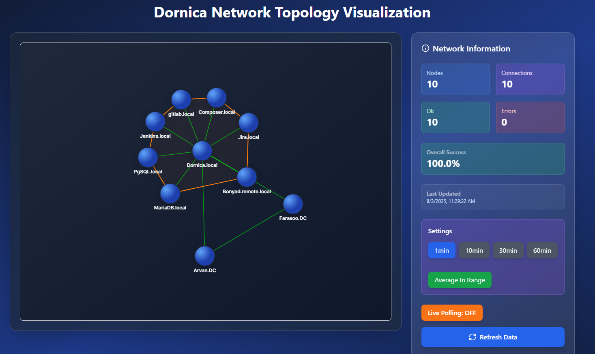

# Dor Radar

Network status radar for dornica infrastructure.



## Features

*   Visualizes network topology as a force-directed graph.
*   Shows connection strength between nodes.
*   Provides detailed information about each node.
*   Allows filtering data by time window and aggregation method.
*   Auto-refreshes data.

## Tech Stack

*   **Backend:** Go, Cobra, Zap
*   **Frontend:** React, Vite, TypeScript, D3.js, TailwindCSS

## Installation

1.  **Clone the repository:**
    ```bash
    git clone https://github.com/fmotalleb/dor-radar.git
    cd dor-radar
    ```

2.  **Run the backend:**
    ```bash
    go run main.go
    ```

3.  **Run the frontend:**
    ```bash
    cd front
    npm install
    npm run dev
    ```

## Configuration

The application is configured using a `config.toml` file. The default path is `./config.toml`, but a different path can be specified using the `-c` or `--config` flag.

The configuration file has two main sections: `core` and `collector`.

### `core`

| Key      | Type   | Description                |
| -------- | ------ | -------------------------- |
| `listen` | string | The address to listen on. |

### `collector`

| Key       | Type          | Description                               |
| --------- | ------------- | ----------------------------------------- |
| `target`  | string (url)  | The target URL to collect data from.      |
| `filter`  | string        | A filter to apply to the collected data.  |
| `reshape` | []ReshapeRule | A list of rules to reshape the data.      |

#### `ReshapeRule`

| Key     | Type     | Description                                         |
| ------- | -------- | --------------------------------------------------- |
| `from`  | string   | The original key to reshape.                        |
| `to`    | string   | The new key to reshape to.                          |
| `attrs` | []string | A list of attributes to associate with the new key. |
| `size`  | int      | The size of the node.                               |

## Usage

To run the application, use the following command:

```bash
go run main.go [flags]
```

### Flags

| Flag       | Shorthand | Type   | Default          | Description         |
| ---------- | --------- | ------ | ---------------- | ------------------- |
| `--config` | `-c`      | string | `./config.toml`  | config file path    |
| `--help`   | `-h`      |        |                  | help for dor-radar  |
| `--version`| `-v`      |        |                  | version for dor-radar|

## License

This project is licensed under the GNU General Public License v3.0. See the [LICENSE](LICENSE) file for details.